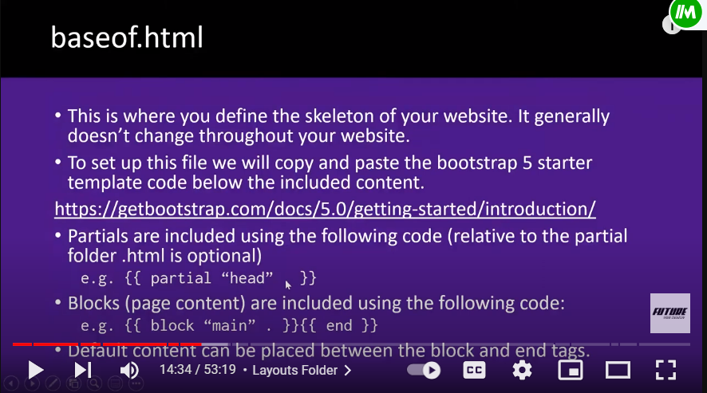
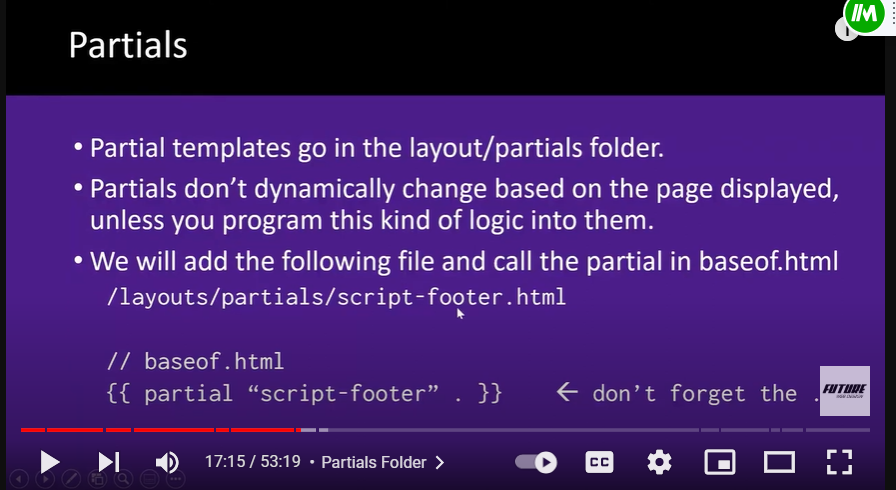
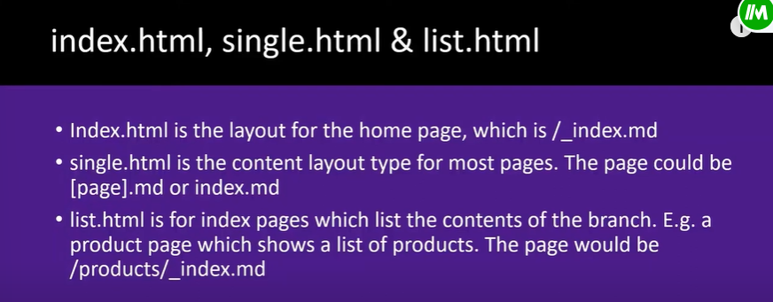
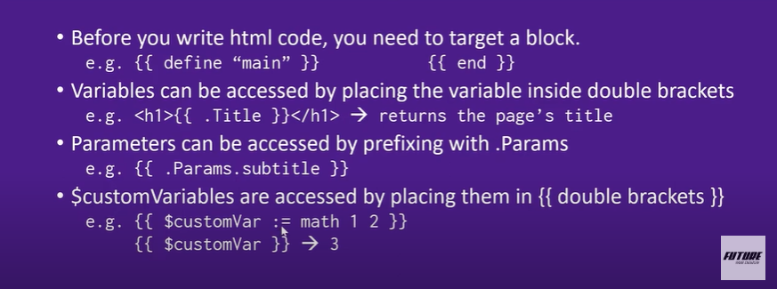
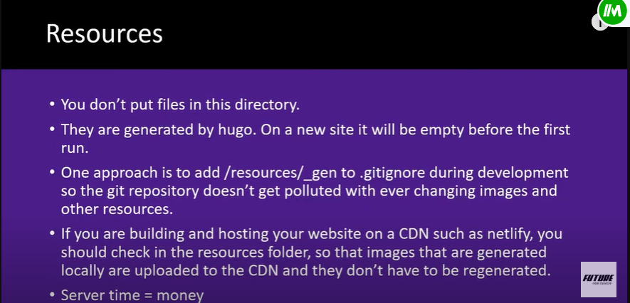
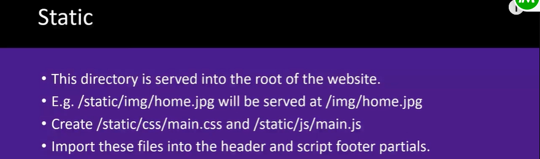
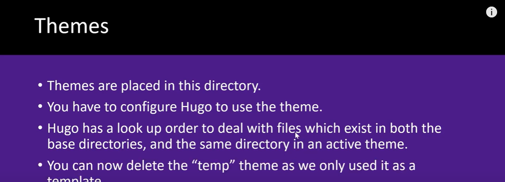

# notes

## Archetypes

holds templates for the creation of md files.

## Content

md files for each website page are here  I did `hugo new _index.md` and it automatically generated the index .md file in content

## Layout

1. baseof.html  This is where you define the skeleton of your website. It generally doesn't change throughout website    

2. Partials    

3. index, single, list.html  
     
   

## Resources

## static

## Themes 

